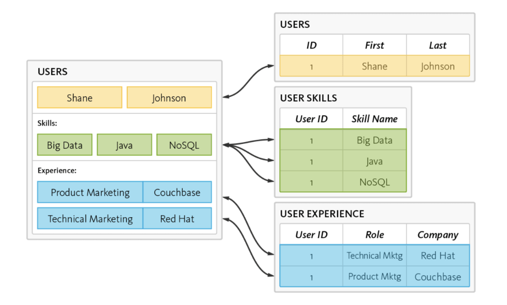

# DBについて

## 目次

- [DBについて](#dbについて)
  - [目次](#目次)
  - [1. DBの分類](#1-dbの分類)
    - [1.1. データ保管場所による分類](#11-データ保管場所による分類)
      - [1.1.1. On-disk DB (Persistent DB)](#111-on-disk-db-persistent-db)
      - [1.1.2. In-memory DB](#112-in-memory-db)
    - [1.2. データ構造による分類](#12-データ構造による分類)
      - [1.2.1. RDBMS (Relational Database Management System)](#121-rdbms-relational-database-management-system)
      - [1.2.2. NoSQL](#122-nosql)
      - [1.2.3. NewSQL](#123-newsql)
  - [2. DB設計](#2-db設計)
    - [2.1. 正規化](#21-正規化)
      - [2.1.1. 第1正規形（1NF）](#211-第1正規形1nf)
      - [2.1.2. 第2正規形（2NF）](#212-第2正規形2nf)
      - [2.1.3. 第3正規形（3NF）](#213-第3正規形3nf)
    - [2.2. DB設計における4大要素](#22-db設計における4大要素)
      - [2.2.1. エンティティ](#221-エンティティ)
      - [2.2.2. 属性](#222-属性)
      - [2.2.3. 関連（リレーション）](#223-関連リレーション)
      - [2.2.4. 関連の多重度](#224-関連の多重度)
    - [2.3. ER図（Entity-Relationship Diagram）](#23-er図entity-relationship-diagram)

## 1. DBの分類

### 1.1. データ保管場所による分類

#### 1.1.1. On-disk DB (Persistent DB)

データをHDDやSSDのような永続的なストレージに保存するDB

(by https://semiconductor.samsung.com/jp/support/tools-resources/dictionary/in-memory-databases/)

- Pros
  - DBサーバを再起動してもデータは消えない
  - 大容量のデータを保存できる

- Cons
  - ディスクI/Oが発生するため、データの読み書きが低速

- 代表的なDB
  - [MySQL](https://www.mysql.com/)
  - [PostgreSQL](https://www.postgresql.org/)
  - [Oracle Database](https://www.oracle.com/database/)

#### 1.1.2. In-memory DB

データをメモリに保存するDB

(by https://semiconductor.samsung.com/jp/support/tools-resources/dictionary/in-memory-databases/)

- Pros
  - メモリにデータがあるため、データの読み書きが高速

- Cons
  - DBサーバの電源が落ちるとデータが消える
  - メモリに保存するため、保存できるデータ量が限られる

- 代表的なDB
  - [SQLite](https://www.sqlite.org/)
  - [Redis](https://redis.io/)
  - [Memcached](https://memcached.org/)

---

### 1.2. データ構造による分類

#### 1.2.1. RDBMS (Relational Database Management System)

相互に関連するデータをテーブルとして保存するDB

(by https://www.couchbase.com/resources/why-nosql/)

- Pros
  - SQLによる複雑なクエリが可能
  - 正規化によりSQLの効率が向上
  - ACID特性により、データの整合性が保たれる
    - **Atomicity**（原子性）
      - トランザクションは全て実行されるか、実行されないかのどちらか
    - **Consistency**（一貫性）
      - トランザクションの前後でデータの整合性が保たれる（決められた制約を守られている状態）
    - **Isolation**（独立性）
      - トランザクションは互いに干渉しない
    - **Durability**（永続性）
      - トランザクションが完了すると、その結果は永続的に保存される

- Cons
  - 水平スケーリングが困難
    - 複数のDBサーバにおいて、トランザクションの整合性を保つことが難しい
    - 分散システムにおいて複数のテーブルを結合するクエリが複雑（ネットワークの遅延も発生）

- 代表的なDB
  - [MySQL](https://www.mysql.com/)
  - [PostgreSQL](https://www.postgresql.org/)
  - [SQLite](https://www.sqlite.org/)

---

#### 1.2.2. NoSQL

RDBMSのようなSQLを使用しないDBの総称

(by https://www.geeksforgeeks.org/introduction-to-nosql-cloud-database-services/)

- Pros
  - 関係を扱わないため結合がなく、データの読み書きが高速
  - SQLを使用しないため、スキーマレスで柔軟なデータ構造が可能（RDBMSにおけるスキーマとはDBの構造）
  - 分散システムの設計原則であるBASE特性を持つ
    - **Basically Available**
      - 基本的に利用可能である（全てのノードが正常に動作していなくても、データの読み書きが可能な状態である）
    - **Soft state**
      - 常に整合性を保つ必要はない
    - **Eventually consistent**
      - 最終的にはデータに一貫性があるようにする
  - 水平スケーリングが容易
    - 複数のDBサーバにデータを分散保存することが可能
    - シャードやレプリカにより、データの読み書きを分散することが可能

- Cons
  - ほとんどのNoSQLはACID特性を持たず、一時的なデータの不整合が発生する可能性がある（一部のNoSQLはACID特性を持つ）

- 代表的なDB
  - ドキュメント型ストア
    - [MongoDB](https://www.mongodb.com/)
  - キーバリュー型ストア
    - [Redis](https://redis.io/)
  - 列指向型ストア
    - [Apache Cassandra](https://cassandra.apache.org/)
  - グラフ型ストア
    - [Amazon Neptune](https://aws.amazon.com/jp/neptune/)

---

#### 1.2.3. NewSQL

RDBMSの課題であったスケーラビリティを解決するために開発されたDB

- Pros
  - RDBMSのACID特性を持ちつつ、NoSQLのスケーラビリティを持つ
  - SQLを使用するため、RDBMSと同様に複雑なクエリが可能
  - 一貫性とネットワーク分断体制に強く、ある程度の可用性も持つ

- Cons
  - まだ新しい技術であるため、導入コストが高い
  - 小規模なクエリに対しては、RDBMSよりもパフォーマンスが低い可能性あり（分散環境間の接続によるオーバーヘッド）

- 代表的なDB
  - [TiDB](https://www.pingcap.com/)
  - [CockroachDB](https://www.cockroachlabs.com/)

## 2. DB設計

### 2.1. 正規化

データの冗長性を排除し、データの整合性を保つための設計手法 
（非正規形 > 第1正規形 > 第2正規形 > 第3正規形）

【商品管理表：非正規形】

| 顧客名 | 住所 | 商品名 | 単価 | 数量 | 合計金額 |
| --- | --- | --- | --- | --- | --- |
| 山田太郎 | 東京都渋谷区 | りんご ぶどう | 100 200 | 2 1 | 400 |
| 田中花子 | 東京都新宿区 | ぶどう | 200 | 1 | 200 |

#### 2.1.1. 第1正規形（1NF）

テーブルの各列から繰り返し項目を排除する

【商品管理表】

| 顧客名 | 住所 | 商品名 | 単価 | 数量 | 合計金額 |
| --- | --- | --- | --- | --- | --- |
| 山田太郎 | 東京都渋谷区 | りんご | 100 | 2 | 200 |
| 山田太郎 | 東京都渋谷区 | ぶどう | 200 | 1 | 200 |
| 田中花子 | 東京都新宿区 | ぶどう | 200 | 1 | 200 |

---

#### 2.1.2. 第2正規形（2NF）

テーブルにおける全ての列から部分関数従属を排除する（エンティティごとにテーブルを分割する）
  - 部分関数従属: 主キーの一部に対して従属する列がある状態

【顧客表】

| 顧客ID（PK） | 顧客名 | 住所 |
| --- | --- | --- |
| 1 | 山田太郎 | 東京都渋谷区 |
| 2 | 田中花子 | 東京都新宿区 |

【商品表】

| 商品ID（PK） | 商品名 | 単価 |
| --- | --- | --- |
| 1 | りんご | 100 |
| 2 | ぶどう | 200 |

【注文表】

| 注文ID | 顧客ID | 商品ID | 数量 | 合計金額 |
| --- | --- | --- | --- | --- |
| 1 | 1 | 1 | 2 | 200 |
| 2 | 1 | 2 | 1 | 200 |
| 3 | 2 | 2 | 1 | 200 |

---

#### 2.1.3. 第3正規形（3NF）

テーブルにおける全ての列から推移的関数従属を排除する
- 推移的関数従属: 非キー列に対して従属する列がある状態（他の列をもとに導出可能な列がある状態）

【顧客表】

| 顧客ID（PK） | 顧客名 | 住所 |
| --- | --- | --- |
| 1 | 山田太郎 | 東京都渋谷区 |
| 2 | 田中花子 | 東京都新宿区 |

【商品表】

| 商品ID（PK） | 商品名 | 単価 |
| --- | --- | --- |
| 1 | りんご | 100 |
| 2 | ぶどう | 200 |

【注文表】

| 注文ID（PK） | 顧客ID | 商品ID | 数量 |
| --- | --- | --- | --- |
| 1 | 1 | 1 | 2 |
| 2 | 1 | 2 | 1 |
| 3 | 2 | 2 | 1 |

---

### 2.2. DB設計における4大要素

#### 2.2.1. エンティティ

データベースに保存するデータの単位（モデリング対象の業務において、管理すべき情報の単位）

- 例: 顧客、商品、注文

#### 2.2.2. 属性

エンティティが持つ情報の単位（エンティティの特性）

- 例: 顧客名、住所、商品名、単価、数量、合計金額

#### 2.2.3. 関連（リレーション）

エンティティ間の関係（エンティティ同士がどのような関係にあるか）

- 例: 顧客が商品を注文する

#### 2.2.4. 関連の多重度

エンティティ間の関係の数（1対1、1対多、多対多）

- 例: 1人の顧客が複数の商品を注文する

### 2.3. ER図（Entity-Relationship Diagram）

エンティティと関連を図示したもの

